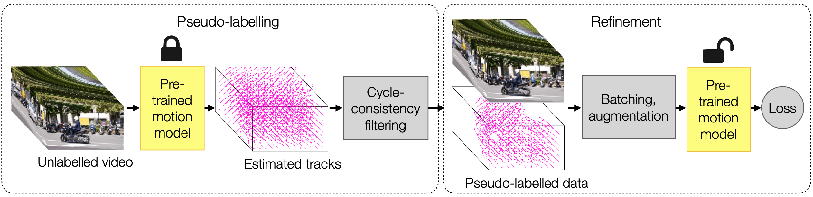
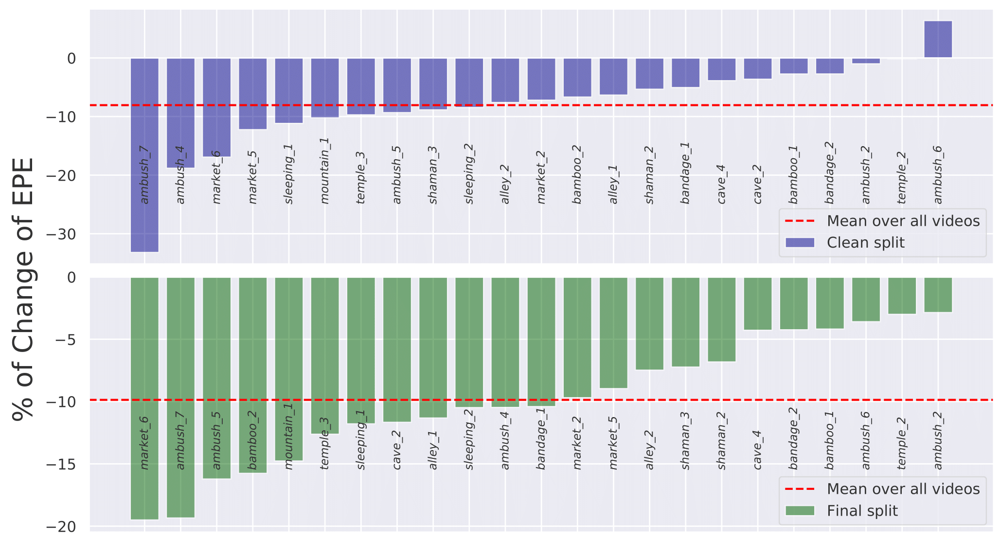
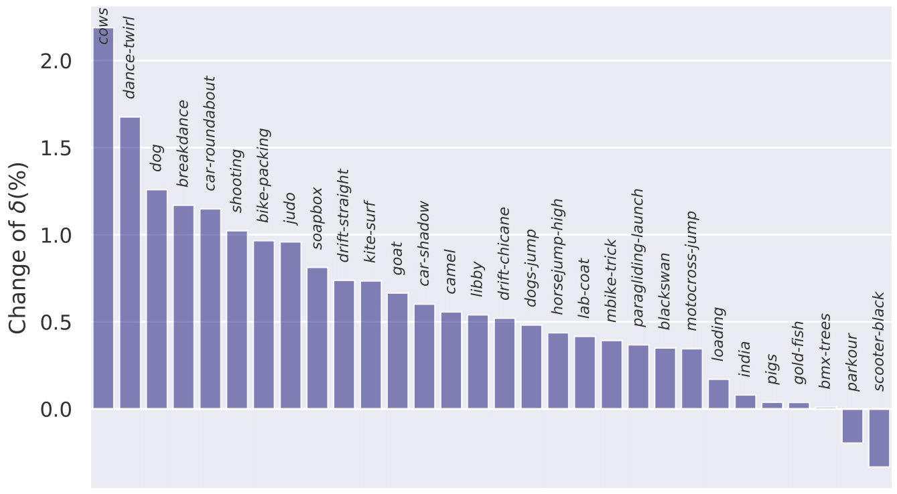
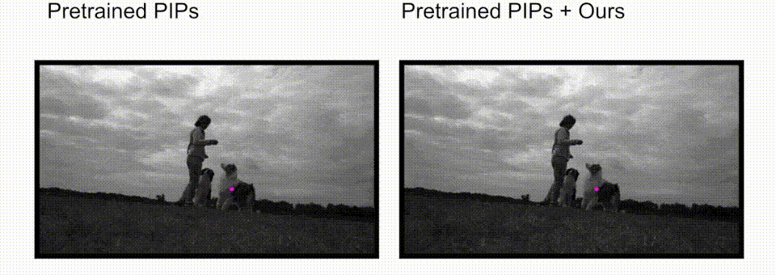

# Refining Pre-Trained Motion Models

This repository is for the method introduced in the following paper accepted by ICRA2024:

Refining Pre-Trained Motion Models\
Xinglong Sun, Adam W. Harley, Leonidas J. Guibas

Arxiv Link: https://arxiv.org/pdf/2401.00850.pdf

Project Website: https://alexsunnik.github.io/refining-motion/

## Introduction
Given the difficulty of manually annotating motion in video, the current best motion estimation methods are trained with synthetic data, 
and therefore struggle somewhat due to a train/test gap. Self-supervised methods hold the promise of training directly on real video, 
but typically perform worse. These include methods trained with warp error (i.e., color constancy) combined with smoothness terms, 
and methods that encourage cycle-consistency in the estimates (i.e., tracking backwards should yield the opposite trajectory as tracking forwards). 
In this work, we take on the challenge of improving state-of-the-art supervised models with self-supervised training. 
We find that when the initialization is supervised weights, most existing self-supervision techniques actually make performance worse instead of better, 
which suggests that the benefit of seeing the new data is overshadowed by the noise in the training signal. Focusing on obtaining a 
"clean" training signal from real-world unlabelled video, we propose to separate label-making and training into two distinct stages. 
In the first stage, we use the pre-trained model to estimate motion in a video, and then select the subset of motion estimates which we can verify with cycle-consistency. 
This produces a sparse but accurate pseudo-labelling of the video. In the second stage, we fine-tune the model to reproduce these outputs, 
while also applying augmentations on the input. We complement this boot-strapping method with simple techniques that densify and re-balance the pseudo-labels, 
ensuring that we do not merely train on "easy" tracks. We show that our method yields reliable gains over fully-supervised methods in real videos, 
for both short-term (flow-based) and long-range (multi-frame) pixel tracking. 

  
  Overview of our method.

## Some Results

  
  Percent change in EPE after our refinement for each video in the MPI Sintel dataset compared with the pretrained RAFT model. Negative value denotes improvement (i.e., error decreasing)

  
  Performance change in δ after our refinement for each of the video in the TapVid-DAVIS dataset compared with the baseline pretrained PIPs model. Positive value denotes improvement (i.e., accuracy increasing)

## Some Visualizations

  
Tracking a point on the dog, original tracker is stuck on the standing person whereas our refinment corrects this mistake.

  
Our approach refines the optical flows by completing missing objects and cleaning noisy tracks.

## Instructions

### Step 1
Download the pretrained PIPs checkpoint here:
https://drive.google.com/file/d/1hCaTcXjIU44LMmvTcuqrrD_zKZNa2W8G/view?usp=drive_link

and put it inside "./reference_model/"

### Step 2
Follow the README instructions in the dataset folder you are interested in.

## Acknowledgement
Some dataloading and evaluation code is from:
https://github.com/google-deepmind/tapnet and
https://github.com/aharley/pips

## Citations
If you find this repo useful to your project or research, please cite our paper below:

@article{sun2024refining,\
    title={Refining pre-trained motion models},\
    author={Sun, Xinglong and Harley, Adam W and Guibas, Leonidas J},\
    journal={arXiv preprint arXiv:2401.00850},\
    year={2024}\
}

